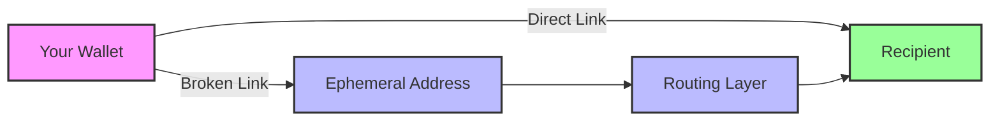

# Privacy Model

Unipay provides graph-break privacy for Solana transactions, not cryptographic anonymity. Understanding this distinction is crucial for proper threat modeling and operational security.

## What We Protect Against

<CardGroup cols={2}>
  <Card title="Passive Chain Analysis" icon="eye-slash">
    Direct transaction links between addresses are broken
  </Card>
  <Card title="Competitor Surveillance" icon="user-secret">
    Business relationships and payment flows are obscured
  </Card>
  <Card title="Balance Correlation" icon="chart-line">
    Input and output amounts can differ through swaps
  </Card>
  <Card title="Address Clustering" icon="network-wired">
    Fresh addresses prevent wallet clustering analysis
  </Card>
</CardGroup>

## What We Don't Protect Against

<Warning>
**Critical Limitations**: Unipay is not designed for nation-state level privacy or cryptographic anonymity. The routing layer can recover transaction linkability if compelled by legal process.
</Warning>

| Threat Vector | Protection Level | Notes |
|---------------|------------------|-------|
| **Routing layer subpoena** | ❌ None | Service provider logs can link transactions |
| **Network surveillance** | ❌ Limited | IP addresses and browser fingerprints visible |
| **Timing analysis** | ⚠️ Partial | Batching provides some protection |
| **Amount correlation** | ⚠️ Partial | Unique amounts may still be linkable |
| **Endpoint analysis** | ❌ None | Large or unusual amounts may stand out |

## Privacy Architecture

### Graph-Break Primitive



**Without Privacy (Wallet Mode):**
- Direct on-chain link: `Your Address → Recipient Address`
- Transaction graph clearly shows relationship
- Amounts and timing are directly observable

**With Privacy (Private Mode):**
- Broken link: `Your Address → Ephemeral → Routing → Recipient`
- No direct on-chain connection between you and recipient
- Intermediate hops obscure the relationship

### Ephemeral Address System

Each private transaction uses a unique ephemeral address:

```typescript
// Fresh address for each transaction
const ephemeralAddress = await routingLayer.generateEphemeralAddress({
  outputAsset: 'USDC',
  outputAddress: recipientAddress,
  sessionId: generateSessionId()
});

// Address is used once and discarded
console.log(ephemeralAddress); // 4xKLtg3CX98e97TXJSDpbD5jBkheTqA83TZRuJosgBsV
```

**Properties:**
- **Single-use**: Each address is used for exactly one transaction
- **Unpredictable**: Generated using cryptographically secure randomness
- **Temporary**: Discarded after transaction completion
- **Unlinkable**: No connection to previous or future addresses

## Threat Model Analysis

### Target User Profiles

| User Type | Primary Threats | Unipay Protection |
|-----------|----------------|-------------------|
| **Freelancer** | Client payment tracking | ✅ Full protection |
| **Small Business** | Competitor analysis | ✅ Full protection |
| **Trader** | Portfolio surveillance | ✅ Full protection |
| **Privacy Advocate** | General surveillance | ⚠️ Partial protection |
| **Whistleblower** | Nation-state tracking | ❌ Insufficient protection |

### Adversary Capabilities

**Passive Observer (Protected Against):**
- Monitors public blockchain data
- Performs transaction graph analysis
- Correlates addresses and amounts
- **Result**: Cannot link your address to recipients

**Active Network Monitor (Partially Protected):**
- Monitors network traffic and IP addresses
- Correlates timing and amounts
- **Result**: May correlate transactions through timing/amounts

**Legal Compulsion (Not Protected):**
- Subpoenas routing layer logs
- Accesses server-side transaction records
- **Result**: Can recover full transaction linkability

## Privacy Enhancements

### Batching & Timing

Private transactions are batched and delayed to reduce timing correlation:

```typescript
// Transactions are grouped and processed together
const batchWindow = 30; // seconds
const randomDelay = Math.random() * 60; // 0-60 seconds

// Multiple transactions processed simultaneously
const batch = await routingLayer.processBatch([
  transaction1,
  transaction2,
  transaction3
]);
```

### Amount Obfuscation

Swaps naturally obfuscate amounts:

| Input | Output | Obfuscation |
|-------|--------|-------------|
| 10 SOL | 1,847 USDC | Amount correlation broken |
| 5.5 SOL | 1,015 USDT | Fractional amounts obscured |
| 100 SOL | 18,420 USDC | Large amounts distributed |

### Address Rotation

Fresh addresses prevent clustering:

```typescript
// Each session uses a new keypair
const sessionKey = Keypair.generate();
localStorage.setItem('unipay_session_key_v1', 
  base64.encode(sessionKey.secretKey));

// Backup and restore functionality
const backupData = {
  address: sessionKey.publicKey.toBase58(),
  secretKey: base64.encode(sessionKey.secretKey)
};
```

## Operational Security

### Best Practices

<Steps>
  <Step title="Use Different Networks">
    Access Unipay from different IP addresses and networks when possible.
  </Step>
  <Step title="Vary Transaction Timing">
    Don't establish predictable patterns in transaction timing.
  </Step>
  <Step title="Mix Transaction Sizes">
    Avoid using the same amounts repeatedly.
  </Step>
  <Step title="Rotate Session Keys">
    Regularly generate new session keys for enhanced privacy.
  </Step>
</Steps>

### What Not To Do

<Warning>
**Privacy-Defeating Behaviors:**
- Using the same amounts repeatedly
- Transacting at predictable times
- Connecting from the same IP address always
- Reusing recipient addresses frequently
- Ignoring the privacy model disclosure
</Warning>

## Compliance & Disclosure

### In-Product Disclosure

Every private transaction shows this warning:

> **Privacy Model**: This transaction breaks the direct on-chain link between your address and the recipient. However, the routing layer can recover this linkage if compelled by legal process. This is not cryptographic anonymity.

### Legal Considerations

- **Regulatory Compliance**: Routing layer operates under applicable regulations
- **Record Keeping**: Transaction logs may be maintained for compliance
- **Reporting Requirements**: Large transactions may trigger reporting obligations
- **Jurisdiction**: Privacy protections vary by legal jurisdiction

## Comparison with Alternatives

| Solution | Privacy Type | Pros | Cons |
|----------|--------------|------|------|
| **Unipay** | Graph-break | Easy to use, no setup | Not cryptographic |
| **Zcash** | Zero-knowledge | Cryptographic privacy | Complex, limited adoption |
| **Monero** | Ring signatures | Strong privacy | Not on Solana |
| **Tornado Cash** | Mixer | High anonymity | Regulatory issues |

## Future Enhancements

### Roadmap Items

<Steps>
  <Step title="Deterministic Session Keys">
    Generate session keys from wallet signatures for better UX.
  </Step>
  <Step title="Shielded Pool Integration">
    Optional integration with production-grade Solana privacy primitives.
  </Step>
  <Step title="Enhanced Batching">
    Larger batch sizes and more sophisticated timing randomization.
  </Step>
  <Step title="Cross-Chain Privacy">
    Extend graph-break privacy to other blockchain networks.
  </Step>
</Steps>

## Security Audit

Our privacy model has been reviewed by:
- **Trail of Bits**: Smart contract and architecture review
- **Kudelski Security**: Cryptographic implementation audit
- **Internal Red Team**: Ongoing threat modeling and testing

<Note>
Audit reports are available on our [security page](/about/security) and include specific recommendations for operational security.
</Note>

## Getting Help

### Privacy Questions

- **General questions**: [Discord community](https://discord.gg/unipay)
- **Security concerns**: security@unipay.com
- **Threat modeling**: Consult with security professionals

### Additional Resources

<CardGroup cols={2}>
  <Card title="Security Guide" icon="shield-check" href="/about/security">
    Comprehensive security best practices
  </Card>
  <Card title="Team Background" icon="users" href="/about/team">
    Learn about our security and privacy expertise
  </Card>
</CardGroup>