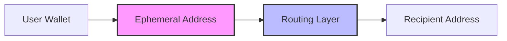

# How It Works

Unipay provides privacy for Solana transactions through a graph-break primitive that separates the on-chain link between sender and recipient addresses.

## Architecture Overview

<Steps>
  <Step title="Client Layer">
    React-based web application that handles wallet connections, transaction construction, and user interface. Runs entirely in the browser with no server-side state.
  </Step>
  
  <Step title="Routing Layer">
    Stateless HTTP services that provide ephemeral deposit addresses and coordinate private transactions. Never holds user funds or maintains persistent state.
  </Step>
  
  <Step title="On-Chain Integration">
    Direct integration with Solana programs including SystemProgram for SOL transfers, Token Program for SPL tokens, and liquidity aggregators for swaps.
  </Step>
</Steps>

## Execution Modes

### Wallet Mode

Standard Solana transaction flow with local signing:

```typescript
// SOL Transfer
const transaction = new Transaction().add(
  SystemProgram.transfer({
    fromPubkey: wallet.publicKey,
    toPubkey: recipientAddress,
    lamports: amount
  })
);

// SPL Token Transfer  
const transaction = new Transaction().add(
  createTransferCheckedInstruction(
    sourceATA,
    mint,
    destinationATA, 
    wallet.publicKey,
    amount,
    decimals
  )
);
```

**Characteristics:**
- Direct on-chain transaction
- Single signature required
- Immediate execution
- Full transaction history visible on-chain

### Private Mode

Privacy-enhanced flow with routing layer:



**Process Flow:**
1. Client requests ephemeral deposit address from routing layer
2. User sends funds to ephemeral address
3. Routing layer detects deposit and initiates output transaction
4. Recipient receives funds from routing layer's address
5. Direct link between user and recipient is broken

## Privacy Model

<Warning>
**Important Disclosure**: Unipay provides graph-break privacy, not cryptographic anonymity. The routing layer can link inputs to outputs if subpoenaed. This tradeoff is disclosed in-product for every private transaction.
</Warning>

### Threat Model

| Adversary Type | Protection Level |
|----------------|------------------|
| Passive chain analysis | ✅ Full protection |
| Competitor surveillance | ✅ Full protection |
| Routing layer subpoena | ❌ Linkability recoverable |
| Nation-state forensics | ❌ Not designed for this threat |

### What We Protect Against

- **Transaction graph analysis**: Direct links between addresses are broken
- **Balance correlation**: Input and output amounts can be different (swaps)
- **Timing analysis**: Transactions are batched and delayed randomly
- **Address clustering**: Fresh addresses used for each transaction

### What We Don't Protect Against

- **Routing layer logs**: Service provider can link transactions if compelled
- **Network-level surveillance**: IP addresses and browser fingerprints
- **Endpoint analysis**: Large or unusual amounts may stand out
- **Social engineering**: User operational security remains critical

## Design Principles

### 1. Non-custodial by Default

```typescript
// All wallet interactions happen client-side
const signedTransaction = await wallet.signTransaction(transaction);

// Backend only proxies network calls
const result = await fetch('/api/broadcast', {
  method: 'POST',
  body: JSON.stringify({ transaction: signedTransaction })
});
```

The browser signs everything that touches the user's wallet. The backend proxies network calls and never holds funds.

### 2. Stateless Services

Every HTTP endpoint is stateless; rebooting the server loses no user state. The client is the source of truth.

```typescript
// No server-side sessions
const status = await checkTransactionStatus(transactionId);

// All state lives in the browser
const sessionKey = localStorage.getItem('unipay_session_key_v1');
```

### 3. Disclosed Tradeoffs

Every Private flow shows the privacy model in the same modal where the deposit address is shown. No hidden assumptions.

### 4. Zero Config to First Transaction

Connect a standard Solana wallet, enter an address, press Continue. Nothing else is required.

### 5. Failure is Loud

Quote failures, RPC errors, and routing errors surface on the same screen that caused them, with the machine-readable code shown below the human-readable message.

## Technical Specifications

### Supported Assets

| Asset | Wallet Mode | Private Mode | Program |
|-------|-------------|--------------|---------|
| SOL | ✅ | ✅ | SystemProgram |
| USDC | ✅ | ✅ | Token Program |
| USDT | ✅ | ✅ | Token Program |
| Token-2022 | ✅ Balance only | ❌ | Token-2022 Program |

### Transaction Limits

| Operation | Wallet Mode | Private Mode |
|-----------|-------------|--------------|
| Send | No limit | Routing layer minimum |
| Swap | No limit | Routing layer minimum |
| Payroll | 12 recipients max | No batch limit |

### RPC Configuration

```typescript
// Default endpoint
const RPC_ENDPOINT = process.env.NEXT_PUBLIC_SOLANA_RPC || 
                    'https://api.mainnet-beta.solana.com';

// Solana Labs endpoint is blocked client-side
if (RPC_ENDPOINT.includes('api.mainnet-beta.solana.com')) {
  throw new Error('Public endpoint blocked for reliability');
}
```

## Next Steps

<CardGroup cols={2}>
  <Card title="Explore Features" icon="compass" href="/features/send">
    Learn about Send, Swap, and Payroll capabilities
  </Card>
  <Card title="Security Details" icon="shield-check" href="/about/security">
    Deep dive into our security model and audit reports
  </Card>
</CardGroup>